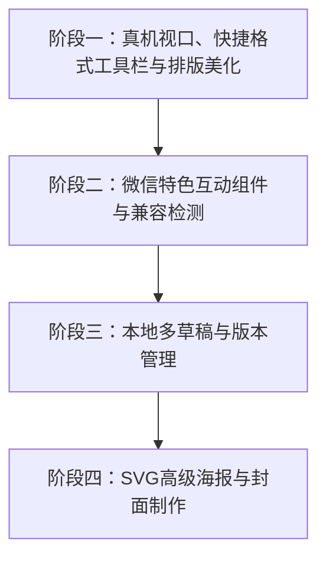

# Claude 排版工具 V3 升级实施计划

为了将“Claude 排版工具”打造为最顶级、最懂微信排版的单文件 Markdown 创作平台，我们规划了以下 V3 升级方案。所有功能将**完全运行于前端（单 HTML 文件）**，无需任何服务器，保障用户的创作隐私与极致的便携性。

本计划将以**模块化、渐进式**的四阶段展开，避免一次性大幅修改影响既有功能的稳定性。

---

## 阶段规划

---

## 阶段一：真机视口模拟、Markdown 编辑辅助工具栏与排版规范化

此阶段聚焦于提升编辑和预览的基础体验，特别是**降低 Markdown 门槛**以及提供最贴近手机端的排版环境。

### 1. Markdown 快捷格式化工具栏 (Markdown Toolbar) [NEW]
*   **设计**：在“Markdown 编辑器”输入框上方，新增一排精美的、符合现代极简风的**格式化快捷工具栏**（类似于 GitHub 评论框或 Typora 的快捷操作栏）。
*   **实现**：
    *   **快捷按钮群**：包含 **粗体** (`**`)、*斜体* (`*`)、~~删除线~~ (`~~`)、`代码/高亮` (`` ` ``)、一级标题 (`#`)、二级标题 (`##`)、三级标题 (`###`)、引用块 (`>`)、无序列表 (`- `)、有序列表 (`1. `)、插入链接 (`[Link](url)`)、插入图片 (``) 以及表格 (`table`)。
    *   **智能光标包裹逻辑**：
        *   当用户在输入框中**选中了文字**时，点击按钮将直接用语法符号“包裹”所选文本（例如，选中 `字体即语气` 点击 **粗体** 按钮，文本自动变为 `**字体即语气**`，且依然保持选中状态）。
        *   当用户**未选中任何文字**时，点击按钮将在光标当前位置插入对应语法模版（例如，点击 **引用** 按钮，插入 `> 引用文本` 并自动将光标定位到“引用文本”中），极大降低新手的排版门槛，完全打消“写错语法”的焦虑。

### 2. 移动端真机视口模拟 (WeChat Device Mockup)
*   **设计**：在右侧预览区顶部添加切换按钮（🖥️ 宽屏网页 / 📱 微信手机端）。
*   **实现**：
    *   在手机模式下，预览容器 `#preview-container` 将缩小并呈现一个精美的 iPhone/Android 微信公众号文章外壳框架。
    *   外壳框架包含：**iOS 状态栏**（时间、信号、电量）、**公众号原生头部**（号主头像、昵称、发表时间、作者名）以及**底部原生互动栏**（喜欢数、在看数、点赞数）。
    *   该外壳框架的内宽限制在 `375px` ~ `414px`（微信最主流的阅读视口宽度），让作者能一眼看清段落换行、行高在手机端是否舒适。

### 3. 中英文混排自动加空格 (Pangu Autospacer)
*   **设计**：在工具栏添加“排版美化”按钮。
*   **实现**：
    *   引入纯 JS 实现的中英文排版规范化逻辑（在汉字与英文字符/数字/半角符号之间自动加入标准 1/4 宽度的空格，例如将 `使用Claude排版` 自动修正为 `使用 Claude 排版`）。
    *   自动纠正中英文符号误用（如中文句末误用半角句号等）。

---

## 阶段二：微信特色组件库与兼容检测 (WeChat Interactive Elements)

针对微信排版的痛点，提供直接拖拽/插入的“不失效”样式模板。

### 1. 微信兼容的 SVG 互动组件
*   **设计**：在侧边栏新增“互动组件”面板，点击可直接向编辑器插入对应的特定语法块。
*   **内置模板**：
    *   **点击展开卡片**：用户点击特定折叠区域，平滑展开内部的隐藏内容。
    *   **左右滑动图组**：微信图文特有的、可横向无限滑动的大图合集。
    *   **刮刮乐/图层擦除**：微信特有的蒙层擦除效果。
*   **技术原理**：使用纯 SVG + CSS 关键帧动画实现（此方法是目前微信唯一不被过滤的富文本互动方案）。

### 2. 微信排版卡片与特色区块
*   **内置模板**：
    *   **对话气泡卡片**（左/右人物对话框）
    *   **带精致标签的重点提示框**（例如带 Accent 色标签的 Note 框）
    *   **双线/花边卡片**
    *   **极简精美分割线**（替代单调的 `hr`）
*   **实现**：在 Markdown 渲染解析器（基于我们现有的 Parser）中，拓展自定义容器解析（如 `:::dialogue-left`），使其在编辑端具有极简的 Markdown 写法，在预览端渲染成高度优化的、微信粘贴不失效的嵌套表格/DIV 结构。

### 3. 微信样式兼容性检测 (Style Linter)
*   **实现**：在复制或导出 HTML 前，对整篇文章的 CSS 进行一轮静态审计。
    *   标红提示不推荐使用的微信黑名单样式（如 `position: absolute`、`grid`、复杂的 `clip-path` 等，因为微信编辑器在粘贴时会自动剥离这些属性，导致版面塌陷）。
    *   检测外链图片是否会导致防盗链裂图，提前发出预警。

---

## 阶段三：本地多草稿与版本历史管理 (Local Draft Manager)

为了防止浏览器崩溃或误刷新导致稿件丢失，同时支持多文章并发创作。

### 1. 草稿箱侧边抽屉
*   **设计**：在左侧编辑器侧边引入一个极简、隐藏式的“草稿箱”面板。
*   **实现**：
    *   **多文档切换**：支持新建、重命名、删除多篇文档，并在多篇稿件之间无缝切换。
    *   **自动备份（Auto-Save）**：每隔 30 秒自动将左侧 Markdown 内容保存至浏览器的 `IndexedDB` 或 `localStorage`。
    *   **版本历史追溯**：保留最近 10 次的自动保存快照，支持一键对比与“时光倒流”回退。

### 2. 纯前端备份导出
*   **实现**：支持“备份整套草稿箱为 JSON 文件”并可一键导入，方便作者跨设备迁移。

---

## 阶段四：高级 SVG 金句海报与封面一键制作 (Visual Generator)

极大地释放作者的视觉设计精力，实现写作、排版、配图的一体化。

### 1. 金句海报生成器 (Poster Generator)
*   **设计**：检测文章中的 `blockquote`（引用），或允许用户手动选择文字，点击“生成金句海报”。
*   **实现**：
    *   弹出一个精美的模态框，提供 3~4 套根据“Claude 温暖审美”设计的高质感海报卡片模板（例如：古典衬线排版、现代渐变色块、极简纸张阴影）。
    *   自动提取当前文章的主标题、副标题与号主头像作为海报底部的水印。
    *   利用 HTML5 Canvas 或纯 SVG 绘制，支持一键下载为高清 PNG 格式，方便用户在微信朋友圈传播引流。

### 2. 微信分享封面图一键输出
*   **设计**：提供一个专为微信公众号首图（尺寸比例 `2.35:1`）和次图（尺寸比例 `1:1`）设计的画布。
*   **实现**：根据当前所选的主题色方案，自动排版带有文章主标题的极简风封面，支持背景模糊、渐变、优雅中英衬线字体的叠加，一键下载，免去使用第三方设计软件的繁琐。

---

## 验证与测试方案

对于每一个开发阶段，我们都将在本机的多个主流浏览器（**macOS Safari, Google Chrome, ARC, Firefox**）上进行全面测试：
1.  **排版渲染一致性**：确认在各浏览器上模拟手机微信外壳时，滚动条表现及卡片阴影一致。
2.  **微信粘贴测试**：每一步生成的 SVG 互动组件及卡片，都会粘贴进微信公众号后台的真实编辑器进行测试，确保格式没有断行、错位或被微信后台的防过滤系统屏蔽。
3.  **大文本负载测试**：对草稿箱自动保存机制在大文件（大于 50,000 字）下的写入延迟进行评测，确保不会引起编辑器的卡顿。

---

## 用户确认

> [!IMPORTANT]
> **请确认上述开发计划的划分与实施细节：**
> 1. 您是否同意按照目前的这四大阶段，由浅入深、分步去实施开发？
> 2. 有没有您想优先开发，或者想进一步微调、补充的新需求？
> 
> 在收到您的反馈并确认后，我们将立即进入**阶段一**的开发，并为您创建 `task.md` 来细化每一项具体任务进度。
